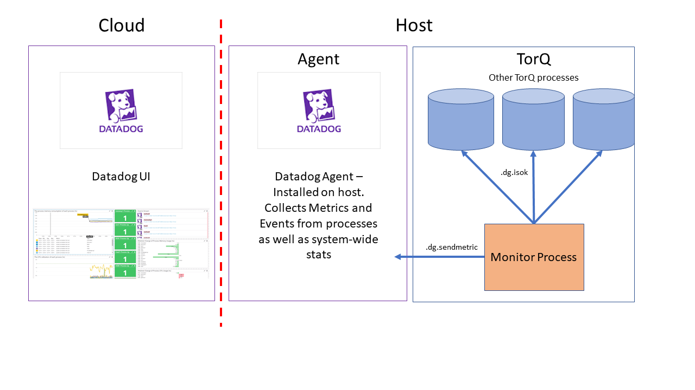
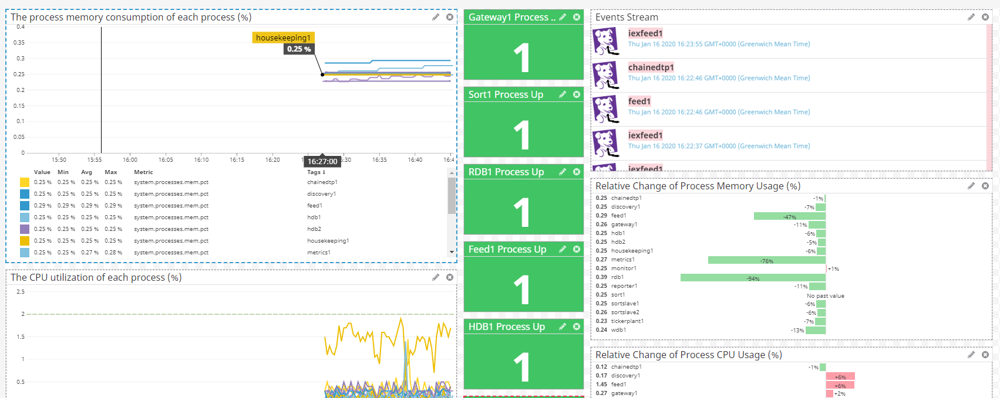

Monitoring TorQ
===============

There are lots of standard tools available to monitor a TorQ stack. It can be easily integrated with incumbent monitoring systems. We have outlined how to use two of our preferred options below- Monit and Datadog. Some of their features overlap and some are complementary. 

Monit
=====

**Monit** is a small open source utility for monitoring and managing UNIX systems. Monit's ease of use makes it the perfect tool for tracking the status of TorQ processes.

Installation
------------
Monit is included in most Unix distributions but can also be downloaded from [here](https://mmonit.com/monit/#download). This monit addition to TorQ allows the monit config files to be easily generated, based on the contents of the process.csv file. 

The basic monit directory which has been added to TorQ can be seen below: 
```
${TORQHOME}
|---monit
    |---bin
    |   |---monit.sh 
    |---templates 
        |---monitalert.cfg
        |---monitrc
        |---monittemplate.txt
```

It is important to mention that AquaQ will not offer support for **monitalert.cfg** and **monitrc**. Those two files have been added as an example on how **monit** can be configured to monitor your system and to offer an out-of-the-box configuration that you can use to test that **monit** works.  If the monit installation contains an updated version of monitrc, this should be used instead. 

Features
--------

Monit is only available for UNIX and it comes with a bash script that you can use to generate the configuration and start the processes. More details on how you use this script can be found below. 

We have also included a standard **monitrc** which will: 

+ Set the check interval to 30 seconds 
+ Set the location of the **monit.log** file 
+ Set the location of **monit.state** fsile 
+ Define the **mail alert** basic configuration 
+ Define the **e-mail format**
+ Set the **interface port** (11000) **user** and **password**
+ Set the location of the ***.cfg** files 

The **monitalert.cfg** it is only an example on how you can configure your own alerts for monitoring your UNIX system. There are no TorQ specific examples in this file. 

The only file which will be updated with future TorQ releases is the **monittemplate.txt** which generates the **monitconfig.cfg**. An example is included below: 

```
check process tickerplant1
  matching "15000 -proctype tickerplant -procname tickerplant1"
    start program = "/bin/bash -c '/home/USER/torqprodsupp/torqdev/deploy/torq.sh start tickerplant1'"
      with timeout 10 seconds
    stop program = "/bin/bash -c '/home/USER/torqprodsupp/torqdev/deploy/torq.sh stop tickerplant1'"
    every "* * * * *"
    mode active
```

Usage Guide
-----------
If you want to use **monit** to monitor your UNIX system and TorQ processes you must first generate the configuration files and then start **monit**. We will assume that you start with a fresh copy of TorQ. 

1. Install TorQ and the any optional customisations (e.g. the TorQ Finanace Starter Pack)
2. Navigate to **${TORQHOME}/monit/bin/**
3. Execute:  
   * bash monit.sh generate all - to generate all the config files 
   * bash monit.sh generate alert - to generate the alert configuration file
   * bash monit.sh generate monitconfig - to generate the monitconfig.cfg 
   * bash monit.sh generate monitrc - to generate the monitrc file 

However, you can also use your own configuration files by either creating a new directory in monit called **config** and moving all the *.cfg files and the **monitrc** file in there or by modifying the last line in the monitrc to point to the folder where the *.cfg files can be found. 

4.  Start monit by executing bash monit.sh start 

The start function also take a parameter **("string")** whch can specify the location of the **monitrc**.

Datadog 
=======

Datadog is a monitoring service for cloud-scale applications, providing
monitoring of servers, databases, tools, and services, through a SaaS-based data
analytics platform. This documentation provides a guideline on how to integrate TorQ and Datadog on
a Linux host.

<div style="width:640px; height:360px; margin: 0 auto;">
<iframe src="https://player.vimeo.com/video/378822571" width="640" height="360" frameborder="0" webkitallowfullscreen mozallowfullscreen allowfullscreen></iframe>
</div>

</br>

Installation
------------

Please Note: At this time the integration of Datadog with TorQ is supported on a unix host. We have not yet provided instructions or functionality for the use of Datadog with TorQ on other operating systems.

The Datadog Agent is software that runs on your host, collecting events and metrics from the host and sending them to Datadog, where you can analyze your monitoring and performance data. We have provided the functionality to monitor system metrics such as CPU and memory usage, report process errors to Datadog, perform data checks and visualise the results on a custom dashboard. The datadog agent can be installed [here](https://www.datadoghq.com/). Note that there are multiple price plans for Datadog, and the functionality available to you is dependent on your plan. 

A 14-day free trial is available, on which all the monitoring provided within this integration will work. 

Once you've set up an account with datadog, more information on getting started can be found [here](https://docs.datadoghq.com/getting_started/agent/). 
An easy one-step install is provided as shown in the video above.

Code is provided within TorQ to enable the integration of Datadog with a TorQ stack on a unix host. The directory layout of the relevant code is as shown below:

```
${TORQHOME}
|---datadog
    |---Example_TorQ_Monitoring_Dashboard.json
    |---monitors
    |---setupdatadog.sh
```

```
${TORQHOME}
|---code
    |---common
    |   |---datadog.q
    |---monitor
        |---datadogchecks.q
```

The `setupdatadog.sh` script is provided as a quick-start install to set up datadog on your host. It edits the config files required by datadog: 

+ Datadog.yaml, which contains the port number to listen on, and enables the agent to receive metrics and events from processes. 
+ Process.yaml, which determines which processes datadog will retrieve CPU and memory stats for. This file is generated using the process.csv, and by default all processes will be monitored. If you wish to monitor only certain processes, a "datadog" column can be added to the process.csv, and a value of 1 or 0 added to each of the processes (1 meaning monitored, 0 meaning not monitored).

Features
--------



* Send Metrics and Events

[Metrics](https://docs.datadoghq.com/metrics/) are values sent from the system to quickly indicate the state of a process or the system itself. We have provided the functionality to send metrics from TorQ processes to the datadog agent, via the `.dg.sendmetric` function. 

```
q) .dg.sendmetric["metric_name";metric_value]

```

The default configuration generated by `setupdatadog.sh` also automates the sending of process stats as metrics, using the process.yaml as a template for which processes to monitor. 

[Events](https://docs.datadoghq.com/events/) are sent in a similar way to Metrics, but indicate a noteworthy record of
activity

We can send an event from a TorQ process using the .dg.sendevent function:

```
.dg.sendevent[event_title;event_text;tags;alert_type]
```

This expects string arguments, and can accept any number of custom tags, and an
alert type one of "error", "warning" or "success".

* Send Process Errors To Datadog

We can utilise the sendevent functionality to track any TorQ process errors on datadog. TorQ provides a hook for extended logging, .lg.ext. We have provided the option to edit this to send errors and warnings to datadog as events:

```
enablelogging:{[]
  .lg.ext:{[olddef;loglevel;proctype;proc;id;message;dict]
  olddef[loglevel;proctype;proc;id;message;dict];
  if[loglevel in `ERR`WARN;.dg.sendevent[string proc;message;string proctype;]$[loglevel=`ERR;"error";"warning"]]}[@[value;`.lg.ext;{{[loglevel;proctype;proc;id;message;dict]}}]]
 }
```

By default, this is not enabled, but should you wish to enable this and view process errors and warnings, you can change the value of .dg.enabled in `$TORQHOME/config/settings/default.q`.

```
.dg.enabled:1b
```

* Automate checks using monitor process

TorQ's [monitor](http://aquaqanalytics.github.io/TorQ/Processes/#monitor) process lets us define a series of user-specific checks to be run at specified intervals on specified processes. 
We have provided an example check (**.dg.isok**) and (**.dg.sendresultmetric**). 

The .dg.isok function is a simple check to see if a process is available and can be queried. The monitor process will execute this function within the processes it has been configured to monitor, and a value of 1b is returned if the process is available. Within the monitor process, the .dg.sendresultmetric result handler then sends this result to datadog as a metric, which can be displayed on the UI dashboard. 

Other checks can be added to provide more specific metrics to monitor, such as table record counts, e.g: 

```
.dg.checkcount:{[table;day] count select from table where date=day}
```

No default monitor configuration is provided, but if you wish to add a check such as the above to be run by the monitor process, the `monitorconfig.csv` can be edited as shown: 

```
family|metric|process|query|resultchecker|params|period|runtime
datadog|okcheck|rdb1;sort1;gateway1;hdb1;hdb2;wdb1;feed1|.dg.isok|.dg.sendresultmetric|`varname`cond!(`datadogcheck;`true)|0D00:01|0D00:00:00.5
```

Usage Guide
-----------

If you wish to incorporate Datadog into your system as a monitoring tool, you can follow the instructions in the video above or the written instructions as follows. This will configure datadog according to default settings, and will not enable error logging or any monitoring functions unless configured by the user.  

1. Install Datadog agent on your host according to instructions [here](https://docs.datadoghq.com/getting_started/agent/?tab=datadogussite)
2. Set up required configuration on host:
    * (Optional) Change the port on which the agent listens, DOGSTATSD_PORT. This can be edited in the setenv.sh script in the $TORQHOME directory, and will default to port 8125.
    * Execute `. setenv.sh` in the $TORHOME directory, to pick up any changes to DOGSTATSD_PORT
    * Execute `. setupdatadog.sh`. This will edit the required datadog config files, datadog.yaml and process.yaml.
    * Restart the datadog agent: `sudo service datadog-agent restart`. This ensures the updated config is used by the agent.

The agent is now reporting process stats, and these can be visualised on the datadog UI. For more detailed metrics and events, enable the error logging using `.dg.enabled:1b` and configure the monitor process to run some checks. 

Using the Datadog UI
--------------------

You can visualise your metrics and events on a dashboard, and configure monitors and alerts. 

An example dashboard has been provided in `$TORQHOME/datadog/Example_TorQ_Monitoring_Dashboard.json.` This displays simple metrics such as process cpu %, process memory % and relative changes in these, as well as TorQ-specific process checks and a stream of any errors from TorQ processes. To import this into your datadog UI, go to the dashboards section [here](https://app.datadoghq.com/dashboard/) And click **add new screenboard**. In the settings section, select **import  dashboard json** and copy and paste the json or browse your files to select the json dashboard you want to import. You will be prompted with whether or  not you want to replace whatever is on the screenboard - click yes. Your dashboard will then load and display as below. The appearance of the dashboard will depend on whether you've enabled the extended error logging, and configured the monitor process. 



Alternatively, you can create your own custom dashboard according to the documentation [here](https://docs.datadoghq.com/dashboards/)

**Monitors** can be set up to track metrics and establish alerts based on critical changes. We've provided some example monitors, designed to notify if a process goes down, or system resources reach a limit. To import an example monitor, go to the "Monitors" section on your datadog account, click **New Monitor**, then **Import Monitor**, and copy and paste the JSON of the monitor you'd like to use into the text box provided, then click save. The monitor will then become available and start alerting.

You can create custom monitors using the guidelines in the Datadog documentation
[here](https://docs.datadoghq.com/monitors/monitor_types/)

Monitoring Multiple Hosts
-------------------------

Depending on your datadog pricing plan, the option to monitor multiple hosts is provided. To integrate Datadog and TorQ across all hosts, you will need to install the agent on each host, and follow the installation instructions as above. If your TorQ setup is operating across different hosts, you will need to establish which processes to monitor on which host by configuring a "datadog" column in the process.csv as discussed earlier.

